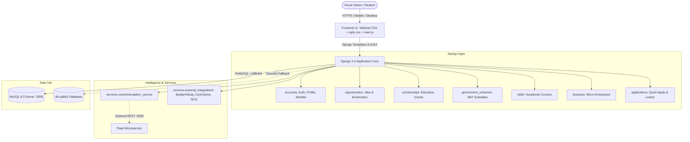

# 🌾 Rural Opportunity Connect (ROC)
### A Full-Stack Platform for UN SDG 10: Reduced Inequalities
**Empowering Rural Citizens, Youth, Students & Micro-Entrepreneurs with Verified Gateways to Jobs, Scholarships, Welfare Schemes, Vocational Training & Business Blueprints.**

---

## 🌟 Executive Summary

**Rural Opportunity Connect** bridges the critical rural-urban opportunity gap in India. Rural students, job seekers, and aspiring micro-entrepreneurs often face significant barriers: decentralized information, complex verification hurdles, language barriers, and fragmented portals.

Built on the **Design Thinking** methodology (**Empathize → Define → Ideate → Prototype → Test**) and aligned directly with **United Nations Sustainable Development Goal 10 (Reduced Inequalities)**, this full-stack platform centralizes 5 key sectors into one accessible, trustworthy, and modern web application.

---

## 🚀 Core Features & Capabilities

1. **5 Opportunity Sectors**:
   - 💼 **Rural & Semi-Urban Jobs**: Verified positions with salary transparency and required skill tags.
   - 🎓 **Higher Education Scholarships**: Merit and need-based financial aid programs.
   - 🏛️ **Government Welfare Schemes**: Direct Benefit Transfer (DBT) and agricultural welfare initiatives.
   - 💻 **Skill Development Programs**: Free and subsidized vocational, digital, and agricultural certifications.
   - 🚀 **Micro-Enterprise Opportunities**: Low-investment village business blueprints with income projections.

2. **1-Click Quick Apply**:
   - Submits applications instantly reusing authenticated profile data without asking redundant questions.
   - Built-in duplicate prevention and real-time visual feedback ("Already Applied ✓").

3. **Live Application Pipeline Tracker**:
   - Real-time stages: `Applied` → `Under Review` → `Shortlisted` → `Selected / Granted` → `Archived`.
   - Stage-wise metric counters and reference ID generation (`ROC-0000X`).

4. **Saved Opportunities Wishlist**:
   - One-click bookmarking across all 5 sectors with interactive heart toggling and category tab filtering (`All`, `Jobs`, `Scholarships`, `Schemes`, `Skills`, `Business`).

5. **Digital Document Readiness Locker**:
   - 8-point official verification checklist (Aadhaar, Marksheet, Income Certificate, Community Certificate, Bank Details, Residence Proof, Passport/Ration Card, PAN Card).
   - Real-time readiness percentage and progress indicator.

6. **Personalized Intelligent Recommendations**:
   - Multi-criteria profile scoring engine calculating match percentages (e.g., `92% Match`) based on education, course stream, skills, location, and income bracket.
   - Resilient hybrid architecture: queries Flask microservice or runs internal Django recommendation service seamlessly.

7. **Universal Multilingual Support**:
   - Persistent language switcher supporting **English**, **தமிழ் (Tamil)**, **हिंदी (Hindi)**, **తెలుగు (Telugu)**, **ಕನ್ನಡ (Kannada)**, and **മലയാളം (Malayalam)**.
   - State persisted across navigation via cookies and LocalStorage.

8. **Admin Dashboard with 1-Click Status Editing**:
   - Django Admin equipped with `list_editable = ('status',)` and bulk action handlers (`Mark Under Review`, `Mark Shortlisted`, `Mark Selected`, `Mark Rejected`).

---

## 🏛️ System Architecture



---

## 💻 Tech Stack

- **Backend**: Python 3.14 / 3.11+, Django 4.2 (LTS)
- **Database**: MySQL 8.0 (`PyMySQL` pure Python driver) with automated SQLite fallback
- **Frontend**: HTML5, Tailwind CSS, Custom Design System (`static/css/style.css`), Vanilla JavaScript (`static/js/main.js`)
- **Typography & Icons**: Google Fonts (*Plus Jakarta Sans*), FontAwesome 6.5.1
- **Recommendation Engine**: Multi-criteria weighted token-matching algorithm
- **Microservices**: Flask 3.1 (`recommendation_api/app.py`)

---

## ⚙️ Windows Installation & Setup Guide

### 1. Prerequisites
- Python 3.8 to 3.14 installed on your Windows machine.
- MySQL 8.0 Server (or MySQL Workbench) installed and running on port `3306`.
- Command Prompt or Windows PowerShell.

---

### 2. Setup Virtual Environment & Install Dependencies

Open PowerShell in the project directory:

```powershell
# Navigate to project directory
cd "C:\Users\ELCOT\.gemini\antigravity-ide\scratch\rural_opportunity_connect"

# (Optional) Create and activate a virtual environment
python -m venv venv
.\venv\Scripts\activate

# Install required Python packages
pip install -r requirements.txt
```

---

### 3. Configure Database (.env)

The project includes an `.env.example` template. Copy it to `.env`:

```powershell
Copy-Item .env.example .env
```

Open `.env` and set your MySQL password:

```env
USE_MYSQL=True
DB_NAME=rural_opportunity_connect
DB_USER=root
DB_PASSWORD=your_actual_mysql_password
DB_HOST=localhost
DB_PORT=3306
```

> **Note on Zero-Downtime Fallback**: If `DB_PASSWORD` is left blank or MySQL is not running, the application will automatically fall back to SQLite (`db.sqlite3`) and remain 100% operational without crashing!

---

### 4. Migrate to MySQL (Automated 1-Command Script)

Run the included automated migration script:

```powershell
python migrate_to_mysql.py --password your_actual_mysql_password
```

This script will:
1. Connect to your local MySQL server.
2. Create the database `rural_opportunity_connect` with `utf8mb4` encoding.
3. Apply all Django migrations.
4. Seed the preserved dataset (all 36 opportunities, 4 users, and 23 applications) from `datadump.json`.

Alternatively, you can run standard Django commands:
```powershell
python manage.py migrate
python -X utf8 manage.py loaddata datadump.json
```

---

### 5. Start the Application

#### Terminal 1: Django Web Server
```powershell
python manage.py runserver
```
The application will be accessible at **`http://127.0.0.1:8000/`**.

#### Terminal 2 (Optional): Recommendation Microservice
```powershell
cd recommendation_api
python app.py
```
*(Note: If the Flask service is not started, Django automatically uses its internal RecommendationService with zero impact on dashboard match scores).*

---

## 🔑 Demo & Admin Credentials

| Role | Username | Password | Notes |
| :--- | :--- | :--- | :--- |
| **Superuser / Admin** | `admin` | `admin123` | Full access to Django Admin (`/admin/`) |
| **Demo Citizen 1** | `Bharathkumar B` | *(register or reset)* | Preloaded application submissions |
| **Demo Citizen 2** | `mohan` | *(register or reset)* | Preloaded profile & documents |

---

## 🧪 Running Automated Tests

Run the comprehensive unit and integration test suite:

```powershell
python manage.py test accounts
```

Output:
```text
Ran 14 tests in 11.409s
OK
```

All 14 test cases cover:
- Public catalog pages rendering (`landing_page`, `about`, `partners`, `jobs_list`, `scholarships_list`, `schemes_list`, `skills_list`, `business_list`, `login`, `register`).
- All 5 sector detail pages rendering.
- Authenticated user pages (`dashboard`, `profile`, `profile_setup`, `saved_opportunities`, `applications`, `document_checklist`).
- Wishlist save/unsave toggle and sector tab filtering (`?type=job`, `?type=all`).
- Quick Apply standard and AJAX duplicate prevention.
- Application tracker stage-wise counters (`under_review`, `shortlisted`, `selected`, `rejected`).
- Document checklist update and percentage score calculation.
- Recommendation matching algorithm scores and rationales.
- Login with target URL redirection.

---

## 📱 Supported Viewports & Responsive Breakpoints

The application has been verified across modern device standards:
- **Mobile (375x812, 390x844)**: Responsive bottom navigation, slideout menu drawer, stackable cards, touch-optimized hit areas.
- **Tablet (768x1024, 1024x768)**: 2-column opportunity grid, quick search bar, collapsible filters.
- **Desktop (1440x900, 1920x1080)**: Full 3-column layouts, sticky sidebar widgets, multi-column footer.

---

## 📜 License & SDG Commitment

Built as a Design Thinking Social Impact prototype under **UN SDG 10: Reduced Inequalities**.
Developed for transparent, inclusive, and equitable rural access.
